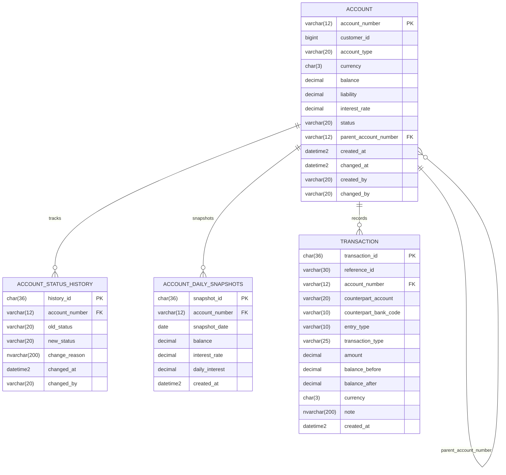

# Hank development notes (for專三)

優先度: 低
內容: 帳戶模組開發 全記錄
負責人: Huang Hank
類別: 參考

# 帳戶模組開發全記錄 - Hank Huang

## 功能需求 （ 管理端 ）

# 帳戶

## 帳戶模組核心 ( 大方向 ）

帳戶不只是用來記錄誰有多少錢，還必須擁有以下四個特點：

1. 精準
    - 嚴格拆分「總餘額」與「可用餘額」
2. 異常監控
    - 從「頻率」、「金額」來監控
3. 防詐
    - 結合異常監控做出應對
4. 支付便利
    - 提供多元管道支付

## 建立帳戶 **( 優先 )**

- 建立前必須先確定操作人員的title，看有無權限，需執行驗證 ( 低優先 )
    - 目前先填入mock data ，等員工表建好。
- 建立前需先判斷帳戶型別，是否符合該型別的持有數規則
    - 依 account_type 判斷
        - `CHECKING(活存)`
            - 同客戶 + 同 currency 已存在活存 → 擋下
            (允許 TWD 活存 + USD 活存並存,但不能有兩個 TWD 活存)
        - `TIME_DEPOSIT(定存)`
            - 不檢查重複,可無限開
        - `LOAN(貸款)`
            - 不檢查重複,可無限開
        - `SUB_ACCOUNT(子帳戶)`
            - 檢查該客戶**是否持有正常狀態(ACTIVE)的台幣活存帳戶，沒有則擋下**
            - 不檢查重複 、可無限開、`限定台幣`
- 需填入已建立顧客資料的 `Customer_ID`，且該顧客需完成KYC，會執行驗證
    - KYC 未通過，需要回傳錯誤並阻止創建。
- 可選擇 “幣別”
    - 目前暫定以下常見的10種幣種
        
        
        | **幣別代碼 (DB 儲存)** | **中文名稱** | **符號 (前端顯示)** | **說明 / 適用場景** |
        | --- | --- | --- | --- |
        | **TWD** | 新台幣 | NT$ | 本國貨幣，所有基礎帳戶的預設幣別。 |
        | **USD** | 美元 | $ | 全球霸主，外匯存款必備。 |
        | **EUR** | 歐元 | € | 歐洲主力貨幣，匯款常用。 |
        | **JPY** | 日圓 | ¥ | 台灣人最愛換的外幣，交易量極大。 |
        | **GBP** | 英鎊 | £ | 傳統強勢貨幣。 |
        | **CNY** | 人民幣 | ¥ | 兩岸貿易與企業金融極常用。 |
        | **AUD** | 澳幣 | A$ | 高利息外幣定存的常見常客。 |
        | **CAD** | 加幣 | C$ | 北美貿易常見外幣。 |
        | **CHF** | 瑞士法郎 | CHF | 財富管理、避險基金常出現的貨幣。 |
        | **HKD** | 港幣 | HK$ | 亞洲金融中心主力。 |
- 可選擇 “帳戶型別”
    - 目前暫定以下的幾種帳戶類別
        - 台幣
            - 活存
                - 新開戶強制綁定至少存 1,000
                - 目前綁死 0.15 %
                - 按月領息 ( 低優先 )
                    
                    **本金 × 約定年利率 × (實際存款天數 ÷ 365天)**
                    
                - 要建一張表作 `account_daily_snapshots` ( 低優先 )
                    - 每天固定一個結帳點（如: 15:00），把當下的餘額存入表中
                    - **公式：`每日日終餘額` × `適用牌告年利率` ÷ `365天`**
            - 定存
                - 可填入利率，根據不同方案
                - 解約 → 牌照利率打8折 ( 低優先 )
        - 貸款
            - 核貸後撥款方法由風控模組執行，金額填入負債中
            - 核貸之後利率由貸款模組計算，扣款方法由貸款模組執行，負債扣除對應金額
        - 子帳戶
            - `必須先有活存戶頭` 才可建創
            - 利率比照活存
            - 例如夢想帳戶
        - 外幣 ( 低優先 )
            - 要有即時匯率API
            - 活存
                - 外幣利息計算比較複雜
                    
                    # 外幣利息計算 — Day Count Convention
                    
                    > 整理各幣別利息計算的分母天數差異(÷360 vs ÷365),以及在 Currency enum 上的實作方式。
                    > 
                    
                    ---
                    
                    ## 1. 為什麼不同幣別分母不同
                    
                    這是國際銀行業的歷史慣例,稱為 **Day Count Convention(計息日數慣例)**。
                    
                    不同貨幣有不同的「一年該算幾天」規則,主要有兩派:
                    
                    - **Actual/365**:一年算 365 天(實際天數)
                        - 使用者:英系金融體系
                    - **Actual/360**:一年算 360 天(商業年)
                        - 使用者:美系金融體系、歐洲大陸
                        - 歷史原因:早期人工計算方便(360 可以被 12、30 整除)
                    
                    註1:雖然 360 < 365,看起來「分母小利息會比較多」,但實務上各幣別的牌告利率本身就已經考量過這個差異,所以對客戶的實際收益影響不大。這只是計算方式的差異,不是誰比較賺。
                    
                    ---
                    
                    ## 2. 幣別與 day count 對照表
                    
                    | 幣別 | 分母 | 所屬體系 |
                    | --- | --- | --- |
                    | `TWD` | 365 | 台灣金融體系 |
                    | `GBP` | 365 | 英系 |
                    | `HKD` | 365 | 英系(港幣歷史沿襲) |
                    | `CNY` | 365 | 中國金融體系 |
                    | `AUD` | 365 | 英系 |
                    | `CAD` | 365 | 英系 |
                    | `USD` | **360** | 美系 |
                    | `EUR` | **360** | 歐洲大陸 |
                    | `JPY` | **360** | 國際慣例 |
                    | `CHF` | **360** | 歐洲大陸 |
                    
                    註2:這個對照表是針對「活存利息計算」的慣例。實務上不同產品(貸款、債券、衍生性商品)可能用不同的 day count,但對 side project 來說統一用活存慣例即可。
                    
                    ---
                    
                    ## 3. 實作方式 — Currency enum 再加一個屬性
                    
                    既然前面 `Currency` enum 已經帶了 `decimalPlaces`,再多一個 `dayCountBasis` 很自然。
                    
                    ### Enum 定義
                    
                    ```java
                    public enum Currency {
                        TWD(2, 365),
                        USD(2, 360),
                        EUR(2, 360),
                        JPY(0, 360),
                        GBP(2, 365),
                        CNY(2, 365),
                        AUD(2, 365),
                        CAD(2, 365),
                        CHF(2, 360),
                        HKD(2, 365);
                    
                        private final int decimalPlaces;
                        private final int dayCountBasis;
                    
                        Currency(int decimalPlaces, int dayCountBasis) {
                            this.decimalPlaces = decimalPlaces;
                            this.dayCountBasis = dayCountBasis;
                        }
                    
                        public int getDecimalPlaces() {
                            return decimalPlaces;
                        }
                    
                        public int getDayCountBasis() {
                            return dayCountBasis;
                        }
                    }
                    ```
                    
                    ### 呼叫方式
                    
                    ```java
                    Currency c = Currency.USD;
                    int basis = c.getDayCountBasis();  // 360
                    
                    Currency c2 = Currency.TWD;
                    int basis2 = c2.getDayCountBasis();  // 365
                    ```
                    
                    **不用傳參數、不用 if-else**,enum 自己知道自己是哪個體系。
                    
                    ---
                    
                    ## 4. 利息計算公式
                    
                    ### 統一公式
                    
                    ```
                    利息 = 本金 × 年利率 × (存款天數 ÷ dayCountBasis)
                    ```
                    
                    不管台幣美金日圓,公式長一樣,只差分母從 enum 拿。
                    
                    ### 程式實作範例
                    
                    ```java
                    public BigDecimal calculateInterest(BigDecimal principal,
                                                         BigDecimal annualRate,
                                                         int days,
                                                         Currency currency) {
                        BigDecimal basis = new BigDecimal(currency.getDayCountBasis());
                    
                        return principal
                            .multiply(annualRate)
                            .multiply(new BigDecimal(days))
                            .divide(basis, 4, RoundingMode.HALF_EVEN);
                    }
                    ```
                    
                    ### 計算範例
                    
                    **情境 A:10 萬台幣活存 30 天,年利率 1.5%**
                    
                    ```
                    100,000 × 0.015 × (30 ÷ 365) = 123.29 元
                    ```
                    
                    **情境 B:1 萬美金活存 30 天,年利率 1.5%**
                    
                    ```
                    10,000 × 0.015 × (30 ÷ 360) = 12.50 美元
                    ```
                    
                    同樣存 30 天、同樣 1.5% 利率,分母不同結果就不同。
                    
                    ---
                    
                    ## 5. 開發建議準則
                    
                    1. **統一計算公式**:不管幣別,都用 `本金 × 利率 × 天數 ÷ basis`
                    2. **basis 從 enum 拿**:絕對不要寫 `if (currency == USD) 360 else 365` 這種散落的判斷
                    3. **四捨五入規則**:使用 `RoundingMode.HALF_EVEN`(銀行家捨入)
                    4. **最後顯示時再套 decimalPlaces**:計算中間過程保留 4 位小數,最後輸出前再用 `setScale` 調整
                    
                    註3:這個設計的好處是「新增幣別只改 enum」,所有計算邏輯都不用動。例如未來要支援 KRW(韓元),只要加一行 `KRW(0, 365)` 就好。
                    
                    ---
                    
                    ## 關鍵觀念 TL;DR
                    
                    1. **÷360 vs ÷365 是歷史慣例**,不是誰比較合理
                    2. **美系/歐陸用 360,英系/台港中用 365**
                    3. **Currency enum 帶 `dayCountBasis` 屬性**,呼叫 `getDayCountBasis()` 取值
                    4. **公式統一**:`本金 × 利率 × 天數 ÷ basis`,分母由 enum 決定
                    5. **未來新增幣別只要改 enum**,不動計算邏輯
            - 定存
- 預設 `status` 為未啟用，不給操作人員做選擇。
    1. `PENDING` → 開戶預設值
    2. `ACTIVE`
    3. `FROZEN`
    4. `DORMANT`
    5. `CLOSED` → 銷戶 , 貸款結清
- 可設定 “利率”
    - 只適用於 「活存」 與 「定存」
- 帳戶由伺服器生產長度為 **12 碼** 的帳號，不給操作人員填入
    1. 前 11 碼，透過亂數拼湊
        - 使用 `SecureRandom` 套件
    2. 邏輯檢核1碼
        - 使用 `Luhn` 演算法 生成
            - 透過前 11 位進行運算，產出固定 1  碼數字
            - 交易作為檢核碼，如: 轉帳。
- 建立時間由 Java 端生成(使用 `@PrePersist` 或 `@CreationTimestamp` )
    - 理由一:統一時區處理,避免資料庫伺服器時區與應用伺服器不一致
    - 理由二:JPA 持久化後,Java 物件記憶體中立即有正確值,不需要 `refresh()` 重新查詢

## 查詢帳戶 **( 優先 )**

- 依 account_number 查單一帳戶
- 依 customer_uuid 查客戶名下所有帳戶
    - 需要做分頁系統 （有公用的）
- 依 status 篩選 ( 例如撈出所有凍結帳戶 )
- 依 account_type + currency 篩選

## 轉帳 ( 優先 )

> 對應帳戶模組核心的「支付便利」特點,提供多元轉帳管道與嚴謹的交易流程。
> 
> 
> 核心原則:**一致性**(原子性操作)、**可追蹤**(完整軌跡)、**安全**(風險檢查)。
> 

---

## 1. 轉帳類型

### 行內轉帳

- 來源與目的帳戶皆為本行帳戶
- 即時到帳
- 免手續費(MVP 假設)

### 跨行轉帳 ( 低優先 )

- 目的帳戶為他行
- 需整合財金公司 (FISC) 清算
- 收取手續費(依金額分級)

註1:side project 階段先做行內轉帳即可,跨行涉及外部 API 與結算規則,複雜度太高。

### 本人跨幣別轉換 ( 低優先 )

- 同客戶名下不同幣別帳戶互轉(例:TWD 活存 → USD 活存)
- 需整合即時匯率 API
- 本質是「結售匯」,不是單純轉帳

---

## 2. 轉帳流程

### 基本流程

```
[前端] 行員/客戶填寫轉帳資料
   ↓
[API] 接收轉帳請求
   ↓
[Step 1] 基本驗證
   ↓
[Step 2] 呼叫風險監控
   ↓
[Step 3] 執行扣款與入帳(同一 transaction)
   ↓
[Step 4] 寫入交易紀錄
   ↓
[Step 5] 回傳結果
```

### 詳細步驟

1. **基本驗證**
    - 來源帳戶存在且為 `ACTIVE` 狀態
    - 來源帳戶餘額 ≥ 轉帳金額
    - 目的帳戶存在且為 `ACTIVE` 狀態
    - 來源與目的帳戶幣別一致(跨幣別走另一流程)
    - 轉帳金額 > 0
2. **風險監控**
    - 呼叫風險監控模組 API
    - 依回傳等級決定放行/擋下/需二次驗證
3. **執行扣款與入帳**
    - 來源帳戶 `balance -= amount`
    - 目的帳戶 `balance += amount`
    - **必須在同一個 `@Transactional` 內**,避免中途失敗導致資金憑空消失或憑空產生
4. **寫入交易紀錄**
    - 建立 `TRANSACTION` 紀錄(低優先,未來做)
    - 紀錄內容:來源、目的、金額、時間、狀態、交易編號
5. **回傳結果**
    - 成功:回傳交易編號、雙方帳戶更新後餘額
    - 失敗:回傳錯誤代碼與原因

---

## 3. 原子性保證

這是轉帳最核心的技術要求:**同一筆轉帳的兩端操作不可分離**。

### 為什麼重要

假設沒有原子性保護:

```
Step A: 來源帳戶 balance -= 1000    ✓ 成功
Step B: 目的帳戶 balance += 1000    ✗ 失敗(網路斷線)

結果:1000 元憑空消失。客戶會告銀行。
```

反之也可能:

```
Step A: 目的帳戶 balance += 1000    ✓ 成功
Step B: 來源帳戶 balance -= 1000    ✗ 失敗

結果:1000 元憑空產生。銀行賠錢。
```

### 實作方式

Spring Boot 使用 `@Transactional` 註記:

```java
@Transactional
public void transfer(String from, String to, BigDecimal amount) {
    // 任何一步拋例外,整個操作都會 rollback
    deductBalance(from, amount);
    addBalance(to, amount);
    recordTransaction(from, to, amount);
}
```

註2:@Transactional 背後是資料庫的 ACID 特性。這不是「多寫幾行程式」的差別,而是「銀行能不能運作」的根本要求。這也是為什麼金融系統一定要用關聯式資料庫(SQL),而不是 NoSQL。

---

## 4. 錯誤處理

| 錯誤情境 | HTTP Status | 錯誤代碼 |
| --- | --- | --- |
| 來源帳戶不存在 | 404 | `SOURCE_ACCOUNT_NOT_FOUND` |
| 目的帳戶不存在 | 404 | `TARGET_ACCOUNT_NOT_FOUND` |
| 來源帳戶非 ACTIVE | 403 | `SOURCE_ACCOUNT_INACTIVE` |
| 目的帳戶非 ACTIVE | 403 | `TARGET_ACCOUNT_INACTIVE` |
| 餘額不足 | 400 | `INSUFFICIENT_BALANCE` |
| 幣別不一致 | 400 | `CURRENCY_MISMATCH` |
| 轉帳金額 ≤ 0 | 400 | `INVALID_AMOUNT` |
| 風險監控攔截 | 403 | `RISK_BLOCKED` |
| 需二次驗證 | 202 | `VERIFICATION_REQUIRED` |

---

## 5. 特殊情境

### 自己轉給自己

- 來源與目的帳戶 account_number 相同 → 直接拒絕,回 `INVALID_TRANSFER`
- 理由:無意義且浪費系統資源

### 同客戶不同帳戶轉帳

- 例:王小明活存 → 王小明子帳戶(夢想帳戶)
- 視同一般轉帳處理,風險監控可能降低警戒

### 轉出導致餘額為 0

- 允許,但若為活存且低於最低門檻(1000),未來可考慮自動轉為 `DORMANT` 狀態
- MVP 階段不處理,維持 `ACTIVE`

---

## 6. 與其他模組的關係

- **呼叫**:風險監控模組(交易前檢查)
- **呼叫**:帳戶模組的餘額更新 API
- **被呼叫**:貸款模組(撥款、還款本質上是轉帳)
- **未來整合**:通知模組(轉帳成功後推播)

### 貸款還款的呼叫範例

```
[貸款模組]
   │ 本月該還 10,000(本金 7,500 + 利息 2,500)
   │ 呼叫轉帳模組的特殊 API
   ↓
[轉帳模組 — 還款專用 API]
   ├─ 來源(客戶活存): balance -= 10,000
   ├─ 目的(銀行利息收入帳): balance += 2,500
   └─ 貸款帳戶: liability -= 7,500
```

註3:還款不是單純兩筆轉帳,而是「一筆扣款分配到多個目的」。所以需要另外設計專用 API,不要硬塞進一般轉帳。

---

## 7. 開發優先順序

**階段 1(MVP):**

- 行內同幣別轉帳
- 基本驗證 + 原子性保證
- 簡易錯誤處理

**階段 2(未來):**

- TRANSACTION 交易紀錄表
- 整合風險監控
- 貸款撥款/還款專用 API

**階段 3(遠期):**

- 跨行轉帳(FISC 整合)
- 跨幣別轉換(匯率 API)
- 預約轉帳、定期定額

---

## 關鍵觀念 TL;DR

1. **原子性是核心**:用 `@Transactional` 保證扣款與入帳同時成功或同時失敗
2. **先驗證再執行**:基本驗證 → 風險監控 → 實際動帳
3. **錯誤要明確**:每種失敗情境要有對應的錯誤代碼,前端才能正確處理
4. **MVP 只做行內同幣別**:跨行、跨幣別是遠期目標
5. **還款不是普通轉帳**:需設計專用 API 處理「一扣多入」的情境

## 利息計算 ( 中優先 )

- 不是操作功能，是運算邏輯，在背後執行
- 需根據帳戶餘額判斷適用的利率

## 風險監控  ( 低優先 )

> 帳戶模組在轉帳 API 收到請求的**瞬間**執行的即時檢查。
> 
> 
> 判斷依據：只看**這一筆交易本身**的資訊,不需要回查歷史資料。
> 

---

## 1. 檢查項目

### A1. 單筆大額交易檢查

- 規則：單筆轉帳金額超過閾值 → 觸發警示
- MVP 寫死閾值：
    - 台幣單筆 > 50 萬 → 警示
    - 美金單筆 > 15,000 → 警示
- 判斷依據：只看這一筆的 `amount`

註1：閾值未來可按幣別設定在 Currency enum 裡,就像 decimalPlaces 和 dayCountBasis 一樣。MVP 先寫死。

### A2. 帳戶狀態檢查

- 規則：來源帳戶或目的帳戶不是 `ACTIVE` → 直接拒絕
- 判斷依據：只看帳戶的 `status` 欄位

### A3. 餘額充足性檢查

- 規則：來源帳戶 `balance < amount` → 直接拒絕
- 判斷依據：只看帳戶的 `balance` 欄位

### A4. 自我轉帳檢查

- 規則：來源與目的帳戶相同 → 直接拒絕
- 判斷依據：只比較兩個 `account_number`

### A5. 幣別一致性檢查

- 規則：來源與目的帳戶幣別不同 → 直接拒絕（跨幣別走另一流程）
- 判斷依據：只比較兩個 `currency`

---

## 2. 執行順序

```
[轉帳 API 收到請求]
   ↓
[A2] 帳戶狀態檢查     → 不是 ACTIVE? 直接拒絕
   ↓
[A5] 幣別一致性檢查   → 幣別不同? 直接拒絕
   ↓
[A4] 自我轉帳檢查     → 自己轉自己? 直接拒絕
   ↓
[A3] 餘額充足性檢查   → 餘額不夠? 直接拒絕
   ↓
[A1] 單筆大額檢查     → 超過閾值? 加風險分數（不一定拒絕）
   ↓
[呼叫交易紀錄模組的歷史檢查]
   ↓
[全部通過 → 執行轉帳]
```

註2：順序有講究。「最便宜的檢查先做」—— 狀態、幣別、自我轉帳都是 O(1) 比較,先過濾掉明顯不合法的請求,避免浪費資源去查歷史資料庫。

---

## 3. 應對機制

| 風險等級 | 處置方式 | 觸發來源 |
| --- | --- | --- |
| 直接拒絕 | 回傳錯誤碼,不執行轉帳 | A2~A5 任一項不通過 |
| 中風險 | 放行 + 推播通知客戶 | A1 單筆大額 |
| 極高風險 | 攔截 + 帳戶轉 `FROZEN` | A1 + 交易紀錄模組的歷史檢查同時觸發 |

註3：帳戶狀態轉 FROZEN 要走 `updateAccountStatus()` 統一入口,並寫入 ACCOUNT_STATUS_HISTORY。

---

## 4. 開發優先順序

**階段 1（MVP）：**

- A2~A5 基本驗證（本來轉帳就要做）
- A1 單筆大額閾值（寫死金額）

**階段 2（未來）：**

- 閾值改用設定檔管理
- 按幣別設定不同閾值（放 Currency enum）

---

## 關鍵觀念 TL;DR

1. **只看「這一筆」**：不查歷史資料,收到請求瞬間就判斷
2. **便宜的先做**：O(1) 比較先過濾,避免浪費 DB 查詢
3. **A2~A5 是基本驗證**：不算「風控」,是轉帳的前置條件
4. **A1 才是真正的風控**：大額閾值判斷,觸發警示但不一定拒絕
5. **凍結帳戶走統一入口**：updateAccountStatus()

# 交易紀錄

## 交易模組核心 ( 大方向）

交易紀錄不只是流水帳,還必須擁有以下四個特點：

1. 不可竄改
    - 寫入後禁止修改與刪除,錯帳只能透過「沖正」產生新紀錄抵銷
2. 完整可追溯
    - 每一筆資金的流動都要記錄「從哪裡來、到哪裡去、多少錢、什麼時候、為什麼」
3. 雙邊記帳
    - 一筆轉帳同時產生兩筆紀錄：轉出方（DEBIT）與轉入方（CREDIT），確保帳務平衡
4. 高效查詢
    - 支援依帳戶、時間區間、交易類型快速查詢，滿足對帳與報表需求

## 新增交易紀錄

> 這個部分不是顯式功能，會在後台默默運作
> 

## 新增記錄

- 每筆交易都需要記錄，該記錄的有以下
    - 內部id — 加快關聯式資料庫系統的查詢速度
    - 業務id — 提供員工業務使用
    - 操作帳號 — 記錄這次的金額影響到哪個帳號
    - 交易類型 — 記錄本次是什麼類型的交易
        - 轉帳
        - 存款
        - 提款
        - 利息入帳
        - 貸款撥款
        - 貸款還款
    - 影響類型 — 記錄這次交易是扣款還是入帳
        - 銀行不能出現負數，只能存影響方向
    - 原餘額 — 交易前的餘額，作為參照
    - 交易後餘額 — 記錄本次改變後的金額
    - 幣別 — 該次交易單位
    - 對手方 — 如果是轉出，還需要記錄對方，否則留空
    - 註記 — 可以備註交易信息
        - 用戶轉帳操作可以新增備註
    - 操作時間 — 記錄操作時間

### 單筆記錄

只要帳戶有任何balance上的更動，就insert一筆進入log

### 轉帳紀錄

當任何transfer發生，講寫入兩筆資料，一筆對應一方，Log記錄會將兩筆的reference_id記錄同一個代號，代表這兩筆資料對應同一筆的交易紀錄。

## 查詢交易紀錄

### 行員使用

- 查詢全部 trans_log
    - 需要做分頁
- 條件查詢 ( 單一 or 複合 )
    - 依 reference_id 查詢
    - 依 account_number 查詢
        - 會查詢 影響帳號 與 對手方帳號
    - 依 create_at 查詢
    - 依 cif 查詢該客戶所有交易紀錄

### 內部使用

- 依 customer_id 查詢全部紀錄
- 依 customer_id + 日期 查詢全部紀錄

## 風險監控  ( 低優先 )

> 交易紀錄模組在轉帳前**回查 TRANSACTION 表的歷史資料**,做頻率與金額的統計分析。
> 
> 
> 判斷依據：看**最近這段期間**的交易行為模式,不是看這一筆交易本身。
> 

---

## 1. 檢查項目

### B1. 短時間高頻交易偵測

- 規則：同一帳戶在 `N 分鐘` 內發起超過 `X 次` 交易 → 觸發警示
    - 預設：5 分鐘內 10 次
- 判斷依據：查 TRANSACTION 表最近 N 分鐘的交易筆數

```sql
SELECT COUNT(*) FROM transaction
WHERE from_account = ?
  AND created_at > DATEADD(MINUTE, -5, GETDATE())
```

- 觸發後行為：
    1. 當下交易進入 `PENDING` 狀態,需人工複核
    2. 寫入 `RISK_EVENT` 風險事件表（低優先,未來做）
    3. 推播通知給客戶確認

註1：這個查詢每次轉帳都要跑,效能很重要。`from_account` + `created_at` 的複合 INDEX 是必要的。

### B2. 24 小時累積金額偵測

- 規則：同一帳戶在 `24 小時內` 累積轉出金額超過 `Y 元` → 觸發警示
    - 預設：台幣 100 萬 / 外幣折合台幣 100 萬
- 判斷依據：查 TRANSACTION 表最近 24 小時的轉出總額

```sql
SELECT COALESCE(SUM(amount), 0) FROM transaction
WHERE from_account = ?
  AND created_at > DATEADD(HOUR, -24, GETDATE())
```

- 注意：要把「這一筆還沒執行的金額」也加上去判斷

```java
BigDecimal totalOutflow = transactionRiskService.sumRecentOutflow(from, 24);
if (totalOutflow.add(currentAmount).compareTo(dailyLimit) > 0) {
    // 累積金額超限
}
```

註2：這個規則對應真實的「人頭帳戶分散匯款」詐騙手法。詐騙集團會用多筆小額轉帳規避單筆大額警示,累積監控就是為了抓這種行為。

### B3. 異常時段偵測 ( 低優先 )

- 規則：非客戶常用時段（如凌晨 2-5 點）發生交易 → 提高風險分數
- 判斷依據：需累積客戶歷史交易時段的統計資料
- MVP 不做

### B4. 新對手方偵測 ( 低優先 )

- 規則：首次轉帳給某個新的收款方 → 提高風險分數
- 判斷依據：查 TRANSACTION 表是否有過 `from_account = A AND to_account = B` 的紀錄
- MVP 不做

---

## 2. 提供給帳戶模組的 Service 介面

交易紀錄模組提供一個 interface,讓帳戶模組的 TransferService 呼叫：

```java
public interface TransactionRiskService {

    /**
     * B1: 查最近 N 分鐘內的交易次數
     * @param accountNumber  來源帳號
     * @param minutes        回查的時間範圍（分鐘）
     * @return 交易次數
     */
    int countRecentTransactions(String accountNumber, int minutes);

    /**
     * B2: 查最近 N 小時內的累積轉出金額
     * @param accountNumber  來源帳號
     * @param hours          回查的時間範圍（小時）
     * @return 累積轉出金額
     */
    BigDecimal sumRecentOutflow(String accountNumber, int hours);
}
```

### 帳戶模組怎麼呼叫

```java
// 帳戶模組的 TransferService 裡
// 在 Part A 的即時檢查都通過後,呼叫 Part B

int recentCount = transactionRiskService.countRecentTransactions(from, 5);
if (recentCount >= 10) {
    // B1 高頻交易警示
}

BigDecimal totalOutflow = transactionRiskService.sumRecentOutflow(from, 24);
if (totalOutflow.add(amount).compareTo(dailyLimit) > 0) {
    // B2 累積金額超限警示
}
```

---

## 3. TRANSACTION 表需要的 INDEX

為了讓 B1、B2 的查詢跑得快,TRANSACTION 表必須有這個複合索引：

```sql
CREATE INDEX idx_tx_from_time ON transaction(from_account, created_at);
```

- B1 用到：`WHERE from_account = ? AND created_at > ?`（COUNT）
- B2 用到：`WHERE from_account = ? AND created_at > ?`（SUM）
- 兩個查詢共用同一個索引

註3：不要拆成兩個單欄位索引。複合索引 `(from_account, created_at)` 讓資料庫可以「先定位到該帳戶,再按時間範圍掃描」,效能遠好於兩個單欄位索引。

---

## 4. 應對機制

| 風險等級 | 處置方式 | 觸發來源 |
| --- | --- | --- |
| 高風險 | 交易轉 `PENDING`,需客戶二次驗證 | B1 高頻交易 / B2 累積超限 |
| 極高風險 | 直接攔截,帳戶轉 `FROZEN`,人工介入 | B1 + B2 同時觸發,或搭配帳戶模組的 A1 |

---

## 5. 開發優先順序

**階段 1（MVP）：**

- B1 高頻交易（寫死 5 分鐘 10 次）
- TRANSACTION 表加 `idx_tx_from_time` 複合索引

**階段 2（未來）：**

- B2 累積金額監控
- RISK_EVENT 事件表
- 推播通知整合
- 閾值改用設定檔管理

**階段 3（遠期）：**

- B3 異常時段偵測
- B4 新對手方偵測
- 客戶歷史行為分析
- 機器學習風險分數

---

## 關鍵觀念 TL;DR

1. **看「最近這段期間」**：需要回查 TRANSACTION 表做統計
2. **B1 抓高頻**：5 分鐘 10 次,對應自動化腳本攻擊
3. **B2 抓分散洗錢**：24 小時累積 100 萬,對應人頭帳戶分散匯款
4. **用 interface 解耦**：帳戶模組不直接碰 TRANSACTION 表
5. **複合索引是效能關鍵**：`(from_account, created_at)` 讓 B1、B2 查詢都快
6. **MVP 先做 B1**：B2 需要累積金額計算,稍複雜,可排第二階段

## Database schema

### 資料庫設計準則 (Design Guidelines)

### 1. 內部主鍵 (Internal PK)：使用 `BIGINT`

- **設計原因**：效能優先。
- **原理**：
    - **比對速度**：CPU 處理數字比對遠快於字串。
    - **儲存效率**：固定 8 Bytes，索引（B-Tree）結構更緊湊。
    - **關聯效能**：外鍵（FK）關聯查詢（JOIN）時，數字索引能極大化查詢速度。
- **Java 對應**：`Long`。

### 2. 業務編號 (Business Key)：使用 `VARCHAR` + `Unique Index`

- **範例**：帳號 (Account Number)、信用卡號、身分證號。
- **設計原因**：格式完整性與語義化。
- **原理**：
    - **前導零 (Leading Zeros)**：`BIGINT` 會抹除開頭的 `0`（如 `001` 變 `1`），`VARCHAR` 可完整保留。
    - **非運算屬性**：業務編號不進行加減乘除，本質上是「具有格式的字串」。
    - **防止溢位**：長數字在轉傳 JSON 或 Excel 時，`VARCHAR` 能避免被誤轉為科學記號。
- **Java 對應**：`String`。

### 3. 狀態與類型 (Status/Type)：使用 `VARCHAR` 對應 `Java Enums`

- **設計原因**：維護性與可讀性。
- **原理**：
    - **可讀性**：資料庫直接顯示 `ACTIVE` 比 `1` 更直觀，方便 DBA 稽核與除錯。
    - **解耦**：若使用 `INT`，當 Java Enum 順序改變時，資料庫數據會出錯；使用 `VARCHAR` 則無此風險。
    - **擴充性**：增加新的類型只需新增字串，不影響既有邏輯。
- **Java 對應**：`Enum` (使用 `@Enumerated(EnumType.STRING)`)。

### 4. 文字內容：`VARCHAR` vs `NVARCHAR`

- **VARCHAR**：適用於純英數內容（如代碼、IP、貨幣代碼）。佔用 1 Byte。
- **NVARCHAR**：適用於包含中文字內容（如姓名、地址）。佔用 2+ Bytes，支援 Unicode 避免亂碼。

### 5. 金額數值：`DECIMAL(p, s)`

- **設計原因**：精確度。
- **原理**：絕對嚴禁使用 `FLOAT` 或 `DOUBLE`。
- **Java 對應**：`BigDecimal`。

### ACCOUNT 帳戶  ( 優先 )

1. account_number — 帳戶號碼 ( 業務編號 )
    - `PK`
    - `NOT NULL`
    - `VARCHAR(12)`
        - 由 Java端生成
2. customer_id — 客戶號碼 ( 內部關聯主主鍵 )
    - `FK` → CUSTOMER ( customer_id )
    - `NOT NULL`
    - `BIGINT`
        - 對應Java Long 型別 ( 物件 )
3. account_type — 帳戶型別
    - `VARCHAR(20)`
    - `NOT NULL`
4. currency — 幣別
    - `CHAR (3)`
        - 因為幣別代碼 `固定` 為3位英文，用 `CHAR` 的效率更好
    - `NOT NULL`
5. balance — 餘額
    - `DECIMAL (19,4)`
        - 前面代表總長，後面代表小數點後幾位小數後四位，整數最多15位
    - `NULL`
    - `DEFAULT 0`
6. liability — 負債
    - `DECIMAL (19,4)`
    - `NULL`
    - `DEFAULT 0`
7. interest_rate — 年利率
    - `DECIMAL (7,5)`
    - `NULL`
8. status — 狀態
    - `VARCHAR (20)`
    - `NOT NULL`
    - 常數，狀態只能有以下幾種，不能手key in
        1. `PENDING` → 開戶預設值
        2. `ACTIVE`
        3. `FROZEN`
        4. `DORMANT`
        5. `CLOSED` → 銷戶 , 貸款結清
9. parent_account_number — 父帳戶(僅子帳戶使用)
    - `VARCHAR(12)`
    - `NULL`
    - FK → ACCOUNT ( account_number )
    - 子帳戶必填 , 其他帳戶為 `NULL`
10. created_at — 建創時間
    - `DATETIME2`
        - 預設不帶長度
        - 格式介紹
            
            # ⏳ 資料庫設計筆記：DATETIME2 詳解
            
            ### 1. 概述
            
            `DATETIME2` 是 SQL Server 建議取代舊版 `DATETIME` 的時間型別。它符合 ANSI 與 ISO 8601 標準，提供更大的日期範圍與更高的精確度。
            
            ### 2. 語法與精確度 (Precision)
            
            語法：`DATETIME2(n)`，其中 `n` 為秒數小數點後的位數（0-7）。
            
            - **DATETIME2(0)**：精確到「秒」。佔用 6 Bytes。
            - **DATETIME2(3)**：精確到「毫秒」（1/1000 秒）。佔用 7 Bytes。**（銀行系統交易紀錄推薦使用）**
            - **DATETIME2(7)**：精確到「100 奈秒」。佔用 8 Bytes（預設值）。
            
            ### 3. DATETIME2 vs DATETIME 對照表
            
            | 比較項目 | DATETIME (舊版) | DATETIME2 (新版) | 優勢 |
            | --- | --- | --- | --- |
            | **日期範圍** | 1753-01-01 到 9999-12-31 | **0001-01-01** 到 9999-12-31 | 支援更久遠的歷史紀錄。 |
            | **時間精確度** | 3.33 毫秒（會產生捨入誤差） | **100 奈秒**（完全精準） | 避免計時誤差，符合物理邏輯。 |
            | **儲存空間** | 固定 8 Bytes | **6 - 8 Bytes** (依精確度) | 視需求節省儲存空間與 I/O。 |
            | **標準規範** | 微軟特規 | **ISO 8601 標準** | 跨語言、跨系統介接格式一致。 |
            
            ### 4. Java 實體類別 (Entity) 對應
            
            在 Spring Boot 中，應對應 Java 8 的時間 API，嚴禁使用舊版 `java.util.Date`。
            
            - **Java 型別**：`java.time.LocalDateTime`
            - **範例程式碼**：
            
            ```java
            @Column(name = "create_at")
            private LocalDateTime createAt;
            ```
            
            ### 5. 開發建議準則
            
            1. **全面棄用 DATETIME**：新專案資料庫 Schema 統一使用 `DATETIME2`。
            2. **推薦精確度**：交易、帳務或稽核軌跡紀錄建議設定為 `DATETIME2(3)`，平衡精確度與儲存空間。
            3. **時區處理**：若業務涉及跨國多時區，應考慮使用 `DATETIME2` 搭配應用程式端統一 UTC 存入，或改用 `DATETIMEOFFSET`。
    - 用過去式命名符合語意
11. created_by — 由誰建立
    - `VARCHAR (20)`
12. changed_at — 更新時間
    - `DATETIME2`
    - 用過去式命名符合語意
13. changed_by — 由誰更改
    - `VARCHAR (20)`

#### `INDEX`

- customer_uuid
    - 此欄位會高頻使用，如：查某客戶所有帳戶。
- status
    - 根據狀態撈帳戶，如：有效帳戶、凍結帳戶。

### ACCOUNT_STATUS_HISTORY 狀態變更紀錄  ( 低優先 )

1. history_id — 歷史紀錄 ID ( 內部 PK )
    - `PK`
    - `NOT NULL`
    - `CHAR ( 36 )`
        - 使用 UUID,由 Java 端生成
2. account_number — 帳戶號碼(關聯帳戶)
    - `FK` → ACCOUNT ( account_number )
    - `NOT NULL`
    - `VARCHAR ( 12 )`
3. old_status — 變更前狀態
    - `VARCHAR ( 20 )`
    - `NULL`
        - 首次建立帳戶時沒有舊狀態,允許為 NULL
    - 常數,狀態只能有以下幾種,不能手 key in
        1. `ACTIVE`
        2. `FROZEN`
        3. `DORMANT`
        4. `CLOSED`
4. new_status — 變更後狀態
    - `VARCHAR ( 20 )`
    - `NOT NULL`
    - 常數,狀態只能有以下幾種,不能手 key in
        1. `ACTIVE`
        2. `FROZEN`
        3. `DORMANT`
        4. `CLOSED`
5. change_reason — 變更原因
    - `VARCHAR ( 200 )`
    - `NOT NULL`
        - 強制填入，但前端做預設選項可選
            - 帳戶建立
            - 客戶申請銷戶
            - 警示帳戶通報
            - 司法凍結
            - 解除凍結
            - 系統自動轉靜止戶
            - 靜止戶活化
            - 其他 ( 請說明 )
6. changed_at — 變更時間
    - `DATETIME2`
    - `NOT NULL`

`INDEX`

- account_number
    - 此欄位會高頻使用,如:查某帳戶的所有狀態變更歷史
- changed_at
    - 時間區間查詢,如:撈某個月所有被凍結的帳戶

### ACCOUNT_DAILY_SNAPSHOTS ( 低優先 )

> 用於每日結帳點記錄帳戶餘額,作為利息計算憑據。
> 
> 
> 僅適用於「活存」與「子帳戶」類型(定存到期才結息,不需要每日快照)。
> 

---

## 欄位定義

1. snapshot_id — 快照 ID ( 內部 PK )
    - `PK`
    - `NOT NULL`
    - `CHAR ( 36 )`
        - 使用 UUID,由 Java 端生成
2. account_number — 帳戶號碼 ( 關聯帳戶 )
    - `FK` → ACCOUNT ( account_number )
    - `NOT NULL`
    - `VARCHAR ( 12 )`
3. snapshot_date — 快照日期
    - `DATE`
    - `NOT NULL`
    - 註1:用 DATE 而非 DATETIME2,因為每天只拍一次照,不需要時分秒
4. balance — 當日日終餘額
    - `DECIMAL ( 19, 4 )`
    - `NOT NULL`
    - 結帳點當下 ACCOUNT.balance 的值
5. interest_rate — 當日適用年利率
    - `DECIMAL ( 7, 5 )`
    - `NOT NULL`
    - 註2:為何要存?因為未來利率若調整,歷史快照仍需保留「當時的利率」才能正確還原利息計算
6. daily_interest — 當日產生利息
    - `DECIMAL ( 19, 4 )`
    - `NOT NULL`
    - 公式: `balance × interest_rate ÷ dayCountBasis`
    - dayCountBasis 由 Currency enum 提供(TWD=365, USD=360 等)
7. created_at — 快照建立時間
    - `DATETIME2`
    - `NOT NULL`
    - 用過去式命名符合語意

`INDEX`

- (account_number, snapshot_date)
    - 複合索引,高頻查詢:「查某帳戶某段期間的所有快照」
    - 註3:建議設為 `UNIQUE`,確保同一帳戶同一天不會有兩筆快照(防止排程重複執行)
- snapshot_date
    - 報表用:「撈某一天所有帳戶的快照」

---

## 業務邏輯說明

### 觸發時機

每日排程(例如 15:00)自動執行,對所有符合條件的帳戶建立快照:

- 條件:`account_type IN ('CHECKING', 'SUB_ACCOUNT')` 且 `status = 'ACTIVE'`
- 不包含:定存(到期結息)、貸款(不適用)、已銷戶帳戶

### 月底結息流程

按月領息的計算流程:

```
月初(如 5/1)計算 4 月份利息:
  SELECT SUM(daily_interest)
  FROM account_daily_snapshots
  WHERE account_number = ?
    AND snapshot_date BETWEEN '2025-04-01' AND '2025-04-30'

→ 得到本月累積利息
→ UPDATE ACCOUNT SET balance = balance + 本月利息
```

註4:這種「每日拍照 + 月底加總」的設計,比「月底一次算 30 天利息」更精準,因為能反映每天餘額變動的實際情況。例如 4/5 存入大筆錢,4/5 之後的每日利息就會更高。

### 與其他模組的關係

- **寫入方**:每日結息排程(系統背景任務)
- **讀取方**:利息結算模組(月初計算本月利息)
- **不該改**:此表為稽核憑據,一旦寫入不應修改或刪除

---

## 注意事項

1. **資料量會很大**:假設 10 萬活存帳戶 × 365 天 = 3650 萬筆/年,要做好分區(partition)規劃
2. **排程失敗要能補跑**:15:00 沒跑成功,隔天要能重跑 4/16 的快照
3. **銷戶當日處理**:帳戶銷戶時,當日快照仍需建立(計算銷戶當天的利息)
4. **幣別差異**:daily_interest 計算時要從 Currency enum 取 dayCountBasis,不可寫死 365

---

## 關鍵觀念 TL;DR

1. **只有活存與子帳戶適用**,定存到期結息、貸款不適用
2. **每日結帳點拍照**,記錄當日餘額、利率、當日產生利息
3. **月底加總當月所有 daily_interest** = 本月應得利息
4. **寫入不可修改**,作為稽核憑據
5. **利率要存快照當下的值**,避免未來利率調整導致歷史資料失真

## Trans_Log ( 優先 )

> 記錄所有帳戶餘額變動的完整軌跡,作為對帳與稽核憑據。
核心原則：寫入後禁止修改與刪除,錯帳只能透過「沖正」產生新紀錄抵銷。
> 

### 欄位定義

1. transaction_id — 交易 ID ( 內部 PK )
    - `PK`
    - `NOT NULL`
    - `CHAR ( 36 )`
        - 使用 UUID,由 Java 端生成
        - 內部關聯用,不對外曝光
2. reference_id — 業務交易編號 ( 對外查詢 )
    - `VARCHAR ( 30 )`
    - `NOT NULL`
        - 行員 / 客戶查詢用,對外曝光的識別碼
        - 格式：`TXN-yyyyMMdd-HHmmss-8碼hex`（由 Java 端生成）
        - 轉帳時：兩筆紀錄（DEBIT + CREDIT）共用同一個 reference_id
        - 單筆交易時：獨立一個 reference_id
        - 不設 UNIQUE（轉帳時兩筆共用同一個值）
3. account_number — 影響帳號
    - `FK` → ACCOUNT ( account_number )
    - `NOT NULL`
    - `VARCHAR ( 12 )`
        - 這筆交易影響的是哪個帳戶
4. counterpart_account — 對手方帳號
    - `VARCHAR ( 20 )`
    - `NULL`
        - 行內轉帳：記錄對方帳號（12碼）
        - 跨行轉帳：記錄他行帳號（最長16碼）
        - 存款 / 提款 / 利息入帳：留 `NULL`
5. counterpart_bank_code — 對手方銀行代碼
    - `VARCHAR ( 10 )`
    - `NULL`
        - 跨行轉帳時填入（如：004 台灣銀行、812 台新銀行）
        - 行內轉帳 / 存款 / 提款：留 `NULL`
6. entry_type — 記帳方向
    - `VARCHAR ( 10 )`
    - `NOT NULL`
    - 常數,只能有以下兩種,不能手 key in
        1. `DEBIT` → 扣款（錢變少）
        2. `CREDIT` → 入帳（錢變多）
    - 註1：銀行不出現負數金額,正負方向完全由此欄位決定
7. transaction_type — 交易類型
    - `VARCHAR ( 25 )`
    - `NOT NULL`
    - 常數,只能有以下幾種,不能手 key in
        1. `TRANSFER` → 轉帳（可能是 DEBIT 或 CREDIT,看轉出方還是轉入方）
        2. `DEPOSIT` → 存款（固定 CREDIT）
        3. `WITHDRAW` → 提款（固定 DEBIT）
        4. `INTEREST` → 利息入帳（固定 CREDIT）
        5. `LOAN_DISBURSEMENT` → 貸款撥款（固定 CREDIT）
        6. `LOAN_REPAYMENT` → 貸款還款（固定 DEBIT）
8. amount — 交易金額
    - `DECIMAL ( 19, 4 )`
    - `NOT NULL`
    - 永遠存正數,方向由 `entry_type` 決定
9. balance_before — 交易前餘額
    - `DECIMAL ( 19, 4 )`
    - `NOT NULL`
    - 交易執行前該帳戶的餘額,作為參照
    - 註2：貸款帳戶（LOAN_DISBURSEMENT / LOAN_REPAYMENT）此欄位存的是 liability 的值,由 transaction_type 判斷語意
10. balance_after — 交易後餘額
    - `DECIMAL ( 19, 4 )`
    - `NOT NULL`
    - 交易執行後該帳戶的餘額
    - 對帳用：任何一筆紀錄都能直接看到「那個瞬間帳戶裡有多少錢」
    - 就像銀行存摺每一行都會印餘額
11. currency — 幣別
    - `CHAR ( 3 )`
    - `NOT NULL`
    - ISO 4217 貨幣代碼
    - 冗餘欄位：雖然可以從 ACCOUNT 表查,但避免每次查交易明細都要 JOIN
12. note — 註記
    - `NVARCHAR ( 200 )`
        - 用 `NVARCHAR` 支援中文備註
    - `NULL`
    - 可備註交易信息,如：用戶轉帳操作可新增備註
13. created_at — 操作時間
    - `DATETIME2(3)`
    - `NOT NULL`
    - 由 Java 端生成
    - 毫秒級精確度,高頻交易才排得出順序

INDEX

- reference_id
    - 一般 INDEX（不是 UNIQUE,因為轉帳時兩筆共用同一個值）
    - 行員依業務編號查交易,高頻使用
- (account_number, created_at) 複合索引
    - 最重要的索引,同時支援：
        - 查某帳戶的所有交易
        - 查某帳戶某時間區間的交易
        - 風控 B1：最近 5 分鐘交易次數（COUNT）
        - 風控 B2：最近 24 小時累積金額（SUM）
- counterpart_account
    - 查「哪些交易轉入了這個帳戶」
    - 中優先,可後補
- transaction_type
    - 篩選特定類型的交易,如：撈出所有轉帳、所有利息入帳
    - 低優先,資料量大時再加

---

## 補充說明

### 轉帳時的寫入範例

王小明（帳號 A）轉 10,000 給李小華（帳號 B）：

```
紀錄 1:
  transaction_id:     uuid-aaa
  reference_id:       uuid-xxx        ← 兩筆共用
  account_number:     A
  counterpart_account: B
  entry_type:         DEBIT
  transaction_type:   TRANSFER
  amount:             10,000
  balance_before:     50,000
  balance_after:      40,000
  currency:           TWD
  note:               "房租"
  created_at:         2025-04-17 10:30:00

紀錄 2:
  transaction_id:     uuid-bbb
  reference_id:       uuid-xxx        ← 兩筆共用
  account_number:     B
  counterpart_account: A
  entry_type:         CREDIT
  transaction_type:   TRANSFER
  amount:             10,000
  balance_before:     20,000
  balance_after:      30,000
  currency:           TWD
  note:               "房租"
  created_at:         2025-04-17 10:30:00
```

### 存款的寫入範例

王小明（帳號 A）臨櫃存入 5,000：

```
紀錄:
  transaction_id:     uuid-ccc
  reference_id:       uuid-yyy
  account_number:     A
  counterpart_account: NULL            ← 沒有對手方
  entry_type:         CREDIT
  transaction_type:   DEPOSIT
  amount:             5,000
  balance_before:     40,000
  balance_after:      45,000
  currency:           TWD
  note:               "臨櫃存款"
  created_at:         2025-04-17 14:00:00
```

### 沖正的寫入範例

行員發現轉錯帳,執行沖正：

```
原始錯誤紀錄（不刪除、不修改）:
  reference_id:  uuid-xxx
  A → B, 10,000, DEBIT
  B → A, 10,000, CREDIT

沖正紀錄（新增兩筆）:
  reference_id:  uuid-zzz          ← 新的 reference_id
  B → A, 10,000, DEBIT             ← 把錢轉回來
  A → B, 10,000, CREDIT
  note: "沖正 ref: uuid-xxx"       ← 在 note 裡記錄原始交易編號
```

---

## 關鍵觀念 TL;DR

1. **只有新增和查詢**,禁止修改與刪除,錯帳用沖正處理
2. **entry_type 管方向**（DEBIT/CREDIT）,**transaction_type 管原因**（TRANSFER/DEPOSIT...）
3. **金額永遠正數**,正負由 entry_type 決定
4. **轉帳產生兩筆紀錄**,共用同一個 reference_id
5. **balance_before / balance_after 是對帳利器**,像存摺每行印餘額
6. **(account_number, created_at) 複合索引最重要**,支援所有高頻查詢

## ERD

https://dbdiagram.io/d/%E7%88%AA%E5%93%87%E9%8A%80%E8%A1%8C-69b7b42bfb2db18e3b8a3298

#註: 為了開發方便 customer_id 先拔掉FK



## Back-End

### Account Status

# Account Status 設計思考 — 單值 vs 多值

> 整理為什麼 ACCOUNT.status 單欄位不夠用、未來需要獨立狀態表的設計考量。
> 
> 
> 目前(4/16)暫定不加,後續再回來改結構。
> 

---

## 1. 目前設計的限制

目前 `ACCOUNT.status` 是單一欄位,只能存**一個狀態值**:

```
PENDING / ACTIVE / FROZEN / DORMANT / CLOSED
```

這些狀態都遵循 **enum 的互斥原則**:一個帳戶在某一時刻,只會處於其中一種狀態。

> 註1:enum(列舉型別)的設計哲學就是「有限且互斥」,例如星期幾、月份、性別代碼,這些都是「非 A 即 B」的關係。status 用 enum 管理符合這個精神。
> 

---

## 2. 互斥狀態 vs 並存狀態

### 互斥狀態(單值,enum 適用)

這類狀態是「**非生即死**」,一次只能一個:

| 狀態 | 說明 |
| --- | --- |
| `PENDING` | 待啟用(開戶預設值) |
| `ACTIVE` | 正常啟用 |
| `FROZEN` | 凍結、警示 |
| `CLOSED` | 結清、銷戶 |
| `DORMANT` | 靜止戶 |

這些狀態**不會同時發生**:帳戶不可能「同時又是 ACTIVE 又是 CLOSED」,邏輯上矛盾。

### 並存狀態(多值,enum 不適用)

但有些狀態**可以同時存在**,且有額外細節要記錄:

| 狀態 | 說明 |
| --- | --- |
| `DERIVED_CONTROL` | 衍伸管制:擁有其他帳戶遭到警示 |
| `LIMITED` | 限額:配合封控偵測異常 |
| `HOLDING` | 圈存:簽帳卡交易、法院命令扣押 |
| `ADMONITION` | 告誡管制:曾遭受洗錢防制法裁處的客戶,必須限制其非實體交易,ATM 限額至 10000 內 |
| `SUSPENDED` | 暫停服務:密碼輸入錯誤次數過多,鎖實體卡交易 |

這類狀態的特徵:

- 可以**多個同時存在**(例如帳戶可以同時是 `LIMITED` + `HOLDING`)
- 有**額外細節要存**(限額多少、圈存金額、法院命令文號...)
- **時效性**:某些管制是有期限的,到期自動解除

註2:這就是為什麼 enum 不夠用。enum 只能回答「是什麼狀態」,但不能回答「同時有哪些狀態」、「這個狀態的細節是什麼」、「什麼時候會解除」。

---

## 3. 為什麼不能把這些狀態塞進同一個 enum

你可能會想:那我 enum 裡多加幾個值就好啊?例如:

```java
public enum AccountStatus {
    ACTIVE, FROZEN, CLOSED,
    ACTIVE_AND_LIMITED,        // ❌
    ACTIVE_AND_HOLDING,        // ❌
    ACTIVE_AND_LIMITED_AND_HOLDING,  // ❌❌❌
    ...
}
```

**這是災難**。5 種可並存狀態,組合起來 = 2^5 = 32 種可能。再加上原本的互斥狀態就爆炸。

真實系統的管制類型可能有幾十種,組合是天文數字,enum 根本無法表達。

---

## 4. 未來擴充方向 — 獨立狀態表

### 資料表設計(未來做)

```
ACCOUNT 表:
  status → 只管互斥的主狀態(ACTIVE / FROZEN / CLOSED...)

ACCOUNT_CONTROL 表(新增):
  * control_id       — PK
  * account_number   — FK
  * control_type     — 管制類型(LIMITED / HOLDING / ADMONITION...)
  * control_detail   — 管制細節(JSON 或獨立欄位)
  * start_at         — 生效時間
  * end_at           — 失效時間(NULL 代表永久)
  * created_by       — 誰加的管制
```

這樣一個帳戶可以有多筆 ACCOUNT_CONTROL 紀錄,查詢時:

```
查某帳戶的狀態全貌 = ACCOUNT.status + ACCOUNT_CONTROL 所有未過期紀錄
```

### 查詢範例

```sql
-- 查王小明帳戶當下的所有管制
SELECT * FROM account_control
WHERE account_number = '123456789012'
  AND (end_at IS NULL OR end_at > NOW());
```

結果可能同時有 `LIMITED` 和 `HOLDING` 兩筆,這在單欄位 enum 做不到。

---

## 5. 現階段決策

**4/16 決議:暫不加 ACCOUNT_CONTROL 表**

原因:

1. MVP 階段聚焦在核心帳戶功能(建立、查詢、利息、轉帳)
2. 衍生管制涉及跨模組聯動(詐騙、洗錢防制、司法凍結),範圍過大
3. Side project 優先度不高

但文件先留著,未來要做時知道怎麼擴充。

註3:這種「現在不做,但先想清楚未來怎麼做」的習慣很重要。因為現在做的 `ACCOUNT.status` 設計,如果未來要加 ACCOUNT_CONTROL,兩者是**相容的**,不會衝突。反之如果現在就把管制塞進 `status` 欄位,未來要拆就要大改。

---

## 6. 其他待確認項目

### 權限檢查模組

- 放在 `system` module 還是 `auth` module?
- 目前未定,先保留在建立帳戶規格中標註「低優先」

---

## 關鍵觀念 TL;DR

1. **互斥狀態用 enum**:PENDING/ACTIVE/FROZEN/CLOSED/DORMANT,一個帳戶同時只能一個
2. **並存狀態用獨立表**:LIMITED/HOLDING/ADMONITION 等管制可多個同時存在
3. **enum 無法表達組合**:強行塞進 enum 會組合爆炸
4. **現階段先做互斥的**,管制類延後到 ACCOUNT_CONTROL 表
5. **現在的設計與未來擴充相容**,不會衝突

### Account Curency 判斷 places

# 幣別處理設計筆記(MVP)

> 整理系統中貨幣欄位的型別選擇、小數位數動態處理、以及 enum 進階用法。
> 

---

## 目錄

1. [貨幣欄位型別:CHAR(3) vs VARCHAR(3)](https://claude.ai/chat/9b3a6afe-da79-4122-a8aa-3f76c35344c9#1-%E8%B2%A8%E5%B9%A3%E6%AC%84%E4%BD%8D%E5%9E%8B%E5%88%A5char3-vs-varchar3)
2. [為什麼要管 decimal_places(小數位數)](https://claude.ai/chat/9b3a6afe-da79-4122-a8aa-3f76c35344c9#2-%E7%82%BA%E4%BB%80%E9%BA%BC%E8%A6%81%E7%AE%A1-decimal_places%E5%B0%8F%E6%95%B8%E4%BD%8D%E6%95%B8)
3. [Enum 進階用法:帶資料的 enum](https://claude.ai/chat/9b3a6afe-da79-4122-a8aa-3f76c35344c9#3-enum-%E9%80%B2%E9%9A%8E%E7%94%A8%E6%B3%95%E5%B8%B6%E8%B3%87%E6%96%99%E7%9A%84-enum)
4. [setScale:動態調整小數位數](https://claude.ai/chat/9b3a6afe-da79-4122-a8aa-3f76c35344c9#4-setscale%E5%8B%95%E6%85%8B%E8%AA%BF%E6%95%B4%E5%B0%8F%E6%95%B8%E4%BD%8D%E6%95%B8)
5. [完整範例](https://claude.ai/chat/9b3a6afe-da79-4122-a8aa-3f76c35344c9#5-%E5%AE%8C%E6%95%B4%E7%AF%84%E4%BE%8B)
6. [MVP 行動清單](https://claude.ai/chat/9b3a6afe-da79-4122-a8aa-3f76c35344c9#6-mvp-%E8%A1%8C%E5%8B%95%E6%B8%85%E5%96%AE)

---

## 1. 貨幣欄位型別:CHAR(3) vs VARCHAR(3)

### ISO 4217 標準

全世界貨幣代碼都是**固定 3 個英文字母**,沒有例外:

- `TWD` 新台幣
- `USD` 美元
- `JPY` 日圓
- `EUR` 歐元
- `CNY` 人民幣

### CHAR vs VARCHAR

| 型別 | 長度 | 適合場景 |
| --- | --- | --- |
| `CHAR(n)` | 固定 n 個字元(不足補空白) | 長度**永遠固定**的資料 |
| `VARCHAR(n)` | 最多 n 個字元(依實際長度) | 長度**會變動**的資料 |

### 結論

- `CHAR(3)`:語意更精確(明確表達「永遠 3 碼」)
- `VARCHAR(3)`:完全 OK,實務上很多系統這樣寫,儲存大小幾乎沒差
- **兩種都可以,MVP 階段不用糾結**

---

## 2. 為什麼要管 decimal_places(小數位數)

### 什麼是 decimal_places

就是**小數點後面有幾位數字**。

| 數字 | decimal_places |
| --- | --- |
| 100 | 0 |
| 100.5 | 1 |
| 100.50 | 2 |
| 100.555 | 3 |

### 不同貨幣的「最小單位」不一樣

| 貨幣 | 最小單位 | decimal_places |
| --- | --- | --- |
| TWD | 分 | 2 |
| USD | cent | 2 |
| **JPY** | **1 円** | **0** ← 特別 |
| EUR | cent | 2 |
| KWD 科威特第納爾 | - | 3(極少數) |

**重點:日圓沒有小數**。1000 円是合法的,但 1000.50 円不存在這種東西。

### 不處理會發生什麼 bug

**情境:客戶存 1000 日圓到帳戶**

如果資料庫寫死 `DECIMAL(18, 2)`:

```
balance = 1000.00  ← 多了 .00,日本人看了會覺得怪
```

更嚴重的情境 — 利息計算:

```
本金 1234 円 × 利率 0.015 = 18.51 円  ❌
                                       應該是 19 円(四捨五入到整數)
```

系統會存出一堆 `.51`、`.37` 這種根本不存在的日圓金額,帳務就爛掉。

### 比喻

`decimal_places` 像**量杯的刻度精度**:

- 台幣量杯的刻度到 0.01 元(2 位)
- 日圓量杯的刻度只到 1 円(0 位),沒有更細的刻度

倒水(算錢)時,最小只能精確到刻度,不能比刻度更細。

---

## 3. Enum 進階用法:帶資料的 enum

### 簡單版 enum(已熟悉)

```java
public enum Currency {
    TWD, USD, JPY, EUR;
}
```

每個值就是一個名字,沒別的東西。

### 進階版 enum(帶資料)

```java
public enum Currency {
    TWD(2),   // 建立 TWD 時,順便塞一個 2 給它
    USD(2),
    JPY(0),   // 日圓 0 位小數
    EUR(2);

    private final int decimalPlaces;

    // 建構子,上面 TWD(2) 的 2 會跑進這裡
    Currency(int dp) {
        this.decimalPlaces = dp;
    }

    // 讓外部可以讀到 decimalPlaces
    public int getDecimalPlaces() {
        return decimalPlaces;
    }
}
```

### 心智模型

每個 Currency 值不只是一個名字,它身上還「**貼了一張標籤**」:

- TWD 身上貼著:2
- USD 身上貼著:2
- JPY 身上貼著:0
- EUR 身上貼著:2

### 執行順序

1. 程式看到 `TWD(2)` → 呼叫建構子,把 2 傳進去
2. 建構子 `this.decimalPlaces = dp` → 把 2 存起來
3. 從此 TWD 身上永遠貼著 2 這張標籤
4. 任何人呼叫 `TWD.getDecimalPlaces()` → 回傳 2

### 外部使用(不用傳參數!)

```java
// 情境一:直接指名
int dp1 = Currency.TWD.getDecimalPlaces();  // dp1 = 2
int dp2 = Currency.JPY.getDecimalPlaces();  // dp2 = 0

// 情境二:從變數拿
Currency userCurrency = Currency.JPY;
int dp3 = userCurrency.getDecimalPlaces();  // dp3 = 0
```

**為什麼不用傳參數?** 因為 `Currency.TWD` 已經告訴程式「我要問的是 TWD」,TWD 自己知道自己的標籤是 2,直接回答就好。

**類比**:問「小明幾歲?」不用再傳「我問的那個小明」,因為你已經指名小明了,小明自己知道。

---

## 4. setScale:動態調整小數位數

### 用途

`setScale` 是 `BigDecimal` 物件的方法,作用是**把小數位數調整成指定數量**。

### 基本用法

```java
BigDecimal num = new BigDecimal("100.567");

// 調整成 2 位小數
num.setScale(2, RoundingMode.HALF_EVEN);  // → 100.57

// 調整成 0 位小數(整數)
num.setScale(0, RoundingMode.HALF_EVEN);  // → 101

// 調整成 1 位小數
num.setScale(1, RoundingMode.HALF_EVEN);  // → 100.6
```

### 參數說明

- 第一個參數:**目標小數位數**(從 enum 拿)
- 第二個參數:**四捨五入規則** → 算錢一律用 `RoundingMode.HALF_EVEN`(銀行家捨入)

### 為什麼用 HALF_EVEN 不是 HALF_UP?

一般四捨五入(HALF_UP)在大量交易下會有系統性偏差(5 永遠進位)。
銀行家捨入(HALF_EVEN):遇到 5 時看前一位,奇數進位、偶數捨去,長期誤差會相互抵消。這是 ISO 標準、金融業慣例。

---

## 5. 完整範例

### 把 enum + setScale 串起來

```java
BigDecimal amount = new BigDecimal("100.567");  // 原始金額
Currency c = Currency.JPY;                       // 帳戶幣別

int dp = c.getDecimalPlaces();                   // 從 JPY 拿到 0

BigDecimal result = amount.setScale(dp, RoundingMode.HALF_EVEN);
// 等同於 amount.setScale(0, RoundingMode.HALF_EVEN)
// result = 101
```

**白話翻譯:**

> 我有一個數字 100.567,帳戶是日圓。日圓規定 0 位小數,所以幫我調整成 0 位 → 101。
> 

### 同樣程式換成台幣

```java
Currency c = Currency.TWD;
int dp = c.getDecimalPlaces();  // dp = 2
BigDecimal result = amount.setScale(dp, RoundingMode.HALF_EVEN);
// result = 100.57
```

**同一段程式,因為 Currency 不同,結果就不同** — 這就是「動態變更尾數」。

---

## 6. MVP 行動清單

套用 MVP 原則,要做的事:

- [ ]  `Currency` enum 加上 `decimalPlaces` 欄位
- [ ]  `balance` 欄位改用 `DECIMAL(19, 4)`(留緩衝空間,支援 3 位小數貨幣)
- [ ]  所有金額運算一律用 `BigDecimal`,**絕對禁用 `double` / `float`**(浮點數誤差會出事)
- [ ]  統一用 `RoundingMode.HALF_EVEN`(銀行家捨入)
- [ ]  API 輸出前按貨幣規則呼叫 `setScale` 格式化

### 儲存與顯示的分工

```
資料庫儲存:DECIMAL(19, 4)          ← 高精度,不失真
  ↓
Java 讀出:BigDecimal                ← 精確運算
  ↓
顯示/輸出給使用者:按貨幣 decimal_places 呼叫 setScale
```

**原則:儲存高精度,顯示低精度**,這是金融系統的標準做法。

---

## 關鍵觀念 TL;DR

1. **CHAR(3) 或 VARCHAR(3) 都可以**,ISO 4217 貨幣代碼固定 3 碼
2. **不同貨幣小數位數不同**:台幣美元 2 位、日圓 0 位
3. **用 enum 帶資料**:把 `decimalPlaces` 綁在 Currency enum 上
4. **`currency.getDecimalPlaces()` 不用傳參數**:它自己知道自己是誰
5. **`setScale(N, HALF_EVEN)` 動態調整小數**:N 從 enum 拿
6. **金額運算一律用 `BigDecimal`**,禁用浮點數

#### reference_id 生成規則

## 1. 格式定義

```
TXN-20250417-103000-8A3F2B1C
```

| 段落 | 內容 | 長度 | 來源 |
| --- | --- | --- | --- |
| 前綴 | `TXN` | 3 碼 | 固定值 |
| 分隔符 | `-` | 1 碼 | 固定 |
| 日期 | `20250417` | 8 碼 | `LocalDateTime` 取 `yyyyMMdd` |
| 分隔符 | `-` | 1 碼 | 固定 |
| 時間 | `103000` | 6 碼 | `LocalDateTime` 取 `HHmmss` |
| 分隔符 | `-` | 1 碼 | 固定 |
| 隨機碼 | `8A3F2B1C` | 8 碼 | `SecureRandom` 取 hex 大寫 |

**總長度：28 碼**

---

## 2. 資料庫欄位

```
reference_id — 業務交易編號（對外查詢）
  * VARCHAR(30)
  * NOT NULL
  * 格式：TXN-yyyyMMdd-HHmmss-隨機8碼hex
```

註1：用 `VARCHAR(30)` 不用 `CHAR(28)`，留 2 碼彈性，未來格式微調不用改欄位。

---

## 3. Java 實作

```java
public static String generateReferenceId() {
    String timestamp = LocalDateTime.now()
        .format(DateTimeFormatter.ofPattern("yyyyMMdd-HHmmss"));

    byte[] bytes = new byte[4];
    new SecureRandom().nextBytes(bytes);
    String random = HexFormat.of().withUpperCase().formatHex(bytes);

    return "TXN-" + timestamp + "-" + random;
}
```

輸出範例：`TXN-20250417-103000-8A3F2B1C`

---

## 4. 撞號分析

- 8 碼 hex = 16^8 ≈ 43 億種組合
- 時間戳精確到「秒」，同一秒內要產生 43 億筆交易才會撞
- 結論：**不可能撞號**
- 保險措施：INSERT 時若撞號,重試最多 3 次（跟帳號生成邏輯一致）

---

## 5. 轉帳時的使用方式

一筆轉帳產生兩筆交易紀錄（DEBIT + CREDIT），**共用同一個 reference_id**：

```
紀錄 1（轉出方）:
  reference_id: TXN-20250417-103000-8A3F2B1C  ← 同一個
  entry_type:   DEBIT

紀錄 2（轉入方）:
  reference_id: TXN-20250417-103000-8A3F2B1C  ← 同一個
  entry_type:   CREDIT
```

行員用 reference_id 查詢時，會查到兩筆紀錄，代表這是一筆完整的轉帳。

---

## 6. 為什麼不用純 UUID

| 比較 | 純 UUID | TXN 格式 |
| --- | --- | --- |
| 範例 | `550e8400-e29b-41d4-...` | `TXN-20250417-103000-8A3F2B1C` |
| 可讀性 | 看不出任何資訊 | 一看就知道是交易、什麼時間 |
| 口述便利性 | 36 碼,客服念到崩潰 | 28 碼,有結構好念 |
| 前綴辨識 | 跟其他 UUID 長一樣 | `TXN-` 開頭一眼辨識 |
| 實作複雜度 | 一行 code | 多幾行,但不複雜 |

---

## 關鍵觀念 TL;DR

1. **格式**：`TXN-yyyyMMdd-HHmmss-8碼hex`，總長 28 碼
2. **欄位**：`VARCHAR(30)`，留彈性
3. **不會撞號**：同一秒 43 億種組合
4. **轉帳共用**：兩筆紀錄用同一個 reference_id
5. **比 UUID 好念**：客服、行員、客戶都看得懂

## Front-End

## 補充

### docker

- `docker compose up -d` → 啟動容器
- `docker compose down` → 停止容器
- `docker compose restart` → 重啟容器